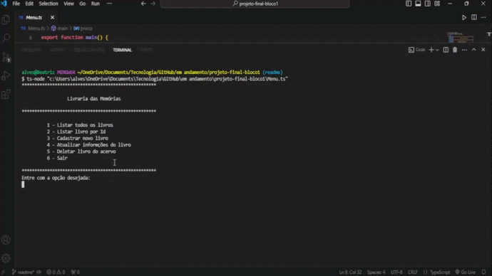

# Livraria das Memórias
Este é o resultado do meu projeto final do bloco 01 do bootcamp da Generation, onde utilizei as tecnologias abordadas durante este período. O desafio foi proposto no formato de performance goal, no qual recebemos uma instrução e um tempo limitado de 02:45 (duas horas e quarenta e cinco minutos) para realizar a tarefa.

Dessa forma, apresento o projeto <strong>Livraria das Memórias</strong>, uma aplicação de e-commerce simples cujo objetivo é permitir que os usuários cadastrem e gerenciem produtos (livros) de forma intuitiva e eficiente.

## Funcionalidades
- Listar todos osprodutos.
- Buscar por ID.
- Cadastrar, atualizar e deletar.

## Tecnologias
- TypeScript
- Node JS
- Pacote readline-sync
- Git

## Como usar
1. Clone o repositório:
```
git clone https://github.com/beatrizalsilva/projeto-final-bloco1.git
```

2. Para entrada de dados, utilize o npm readline-sync:
```
// pacote com as definições do Node
npm install @types/node

// definições para o TypeScript
npm install --save-dev @types/readline-sync
```

3. Após a instalação, teste as funcionalidades pela classe Menu.
* Caso você não tenha o `Code Run` (extensão VS Code) instalado, através do terminal você pode execultar o arquivo Menu.ts com o seguinte comando:
```
ts-node Menu.ts
``` 

## Demonstração


## Conclusão
Foi uma experiência gratificante e desafiadora ao mesmo tempo. Durante esse processo, pude aplicar não apenas os conhecimentos técnicos, mas também a resiliência e a gestão do tempo neste curto período. Seguir o conselho dos professores sobre reaproveitamento de código foi crucial, não apenas para economizar tempo e cumprir o prazo de entrega, mas também evitei sentimentos de incapacidade ao começar do zero.Além disso, este projeto me permitiu unir duas das minhas paixões - tecnologia e livros - em um único lugar.

Ao fazer esse projeto aprofundei meus conhecimentos em TypeScript e Programação Orientada a Objetos, explorando conceitos como classes, objetos, herança e polimorfismo. Além disso, a tomada de decisões foi um aspecto importante, pois precisei definir o tipo de produto que estaria trabalhando e sua base de dados.

Reconheço que ainda há pontos a serem melhorados, e estou comprometida em continuar estudando e trazendo essas melhorias ao projeto conforme avanço nos meus estudos.